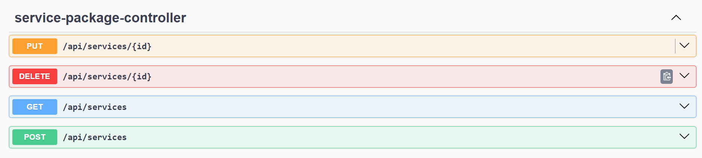
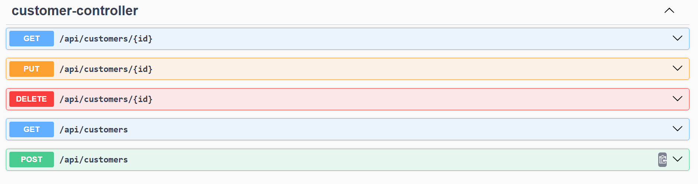
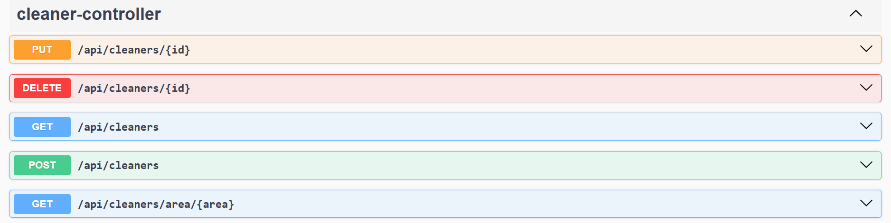
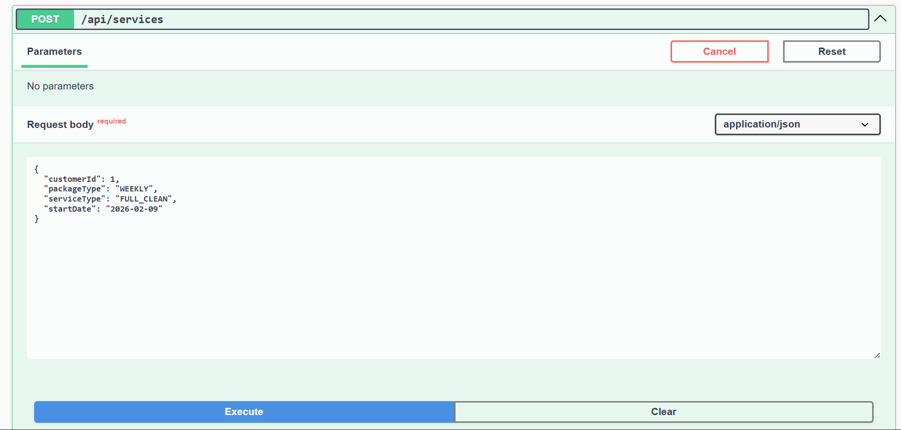
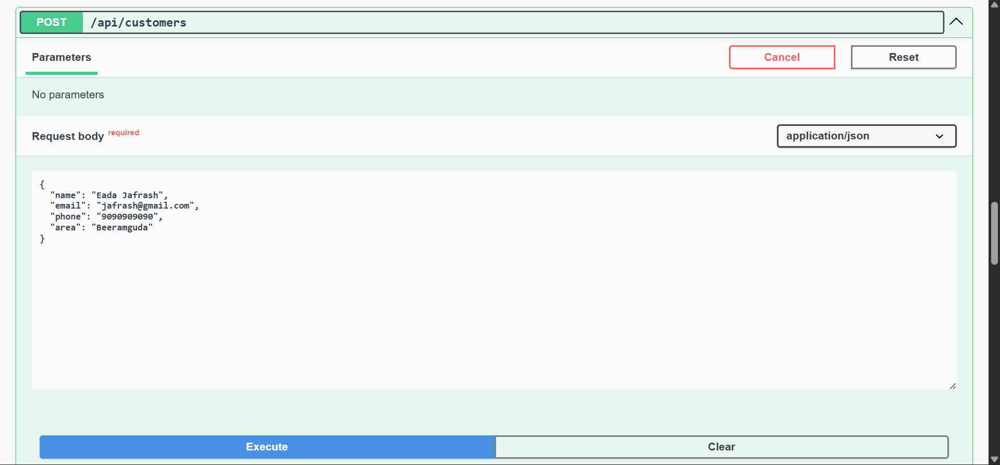
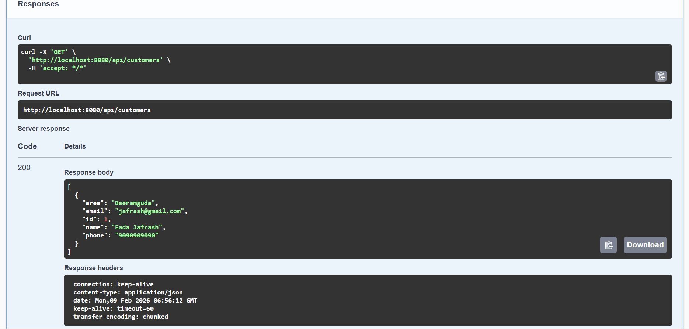
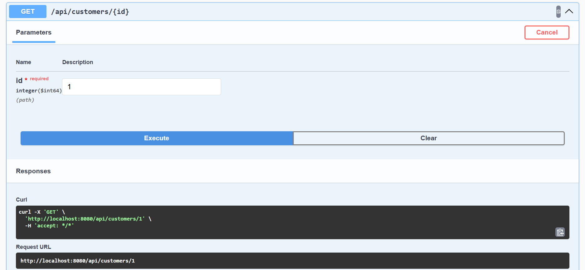

# Car Wash Management System

A RESTful API service for managing car wash operations, including customer management, cleaner assignment, and service package booking.


## Features

- Cleaner management with area-based availability
- Service package creation and tracking
- Multiple service types (DAILY, WEEKLY, MONTHLY)
- Package types (BASIC, STANDARD, PREMIUM)
- Service status tracking (ACTIVE, COMPLETED, CANCELLED)
- Area-based cleaner assignment
- RESTful API with Swagger documentation
`

The application will start on `http://localhost:8080`

## API Documentation

Once the application is running, access the Swagger UI at:

```
http://localhost:8080/swagger-ui.html
```

## API Endpoints

### Customer Management

- `POST /api/customers` - Create a new customer
- `GET /api/customers` - Get all customers
- `GET /api/customers/{id}` - Get customer by ID
- `PUT /api/customers/{id}` - Update a customer
- `DELETE /api/customers/{id}` - Delete a customer

### Cleaner Management

- `POST /api/cleaners` - Create a new cleaner
- `GET /api/cleaners` - Get all cleaners
- `GET /api/cleaners/area/{area}` - Get available cleaners by area
- `PUT /api/cleaners/{id}` - Update a cleaner
- `DELETE /api/cleaners/{id}` - Delete a cleaner

### Service Package Management

- `POST /api/services` - Create a new service package
- `GET /api/services` - Get all service packages
- `PUT /api/services/{id}` - Update a service package
- `DELETE /api/services/{id}` - Delete a service package

## Database

The application uses H2 in-memory database. Access the H2 console at:

```
http://localhost:8080/h2-console
```

**Connection Details:**
- JDBC URL: `jdbc:h2:mem:carwashdb`
- Username: `sa`
- Password: _(leave empty)_

## Data Models

### Customer
- ID, Name, Email, Phone, Area

### Cleaner
- ID, Name, Email, Phone, Area, Experience, Salary, Availability

### Service Package
- ID, Customer, Cleaner, Package Type, Service Type, Start Date, End Date, Status

### Enums
- **PackageType**: BASIC, STANDARD, PREMIUM
- **ServiceType**: DAILY, WEEKLY, MONTHLY
- **ServiceStatus**: ACTIVE, COMPLETED, CANCELLED

## Sample API Requests

### Create Customer
```json
POST /api/customers
{
  "name": "John Doe",
  "email": "john@example.com",
  "phone": "1234567890",
  "area": "Downtown"
}
```

### Create Cleaner
```json
POST /api/cleaners
{
  "name": "Jane Smith",
  "email": "jane@example.com",
  "phone": "0987654321",
  "area": "Downtown",
  "experience": 5,
  "salary": 3000.0,
  "available": true
}
```

### Create Service Package
```json
POST /api/services
{
  "customerId": 1,
  "area": "Downtown",
  "packageType": "PREMIUM",
  "serviceType": "WEEKLY",
  "startDate": "2024-01-01",
  "endDate": "2024-12-31"
}
```

## API Output Screenshots

### Swagger UI Endpoints








## Project Structure

```
src/main/java/com/example/carwash/
├── controller/          # REST Controllers
├── dto/                 # Data Transfer Objects
├── exception/           # Exception Handlers
├── model/              # Entity Models
├── repository/         # JPA Repositories
└── service/            # Business Logic
```

